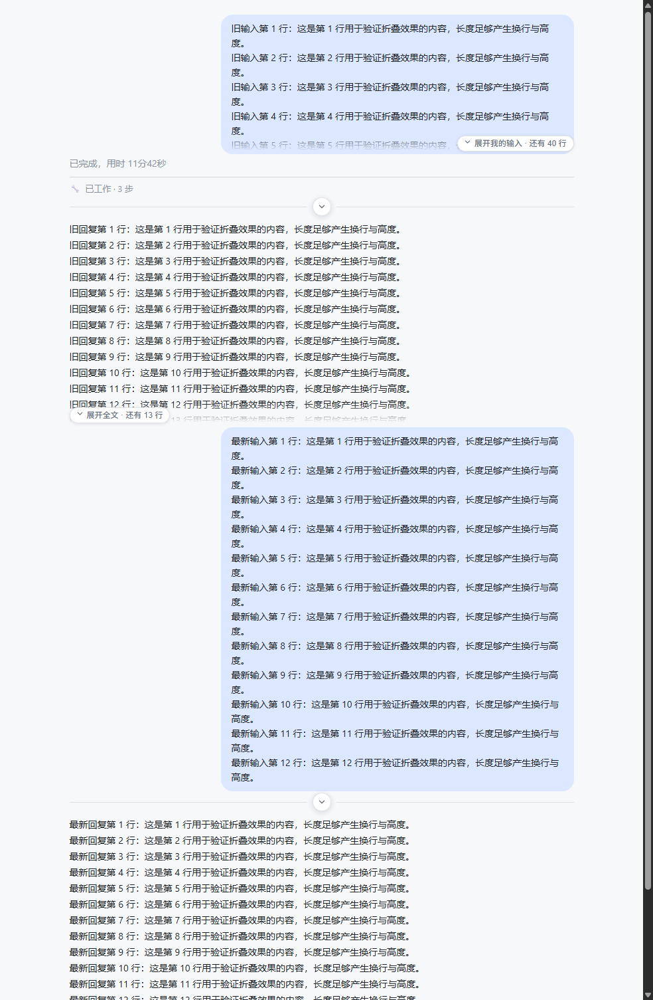
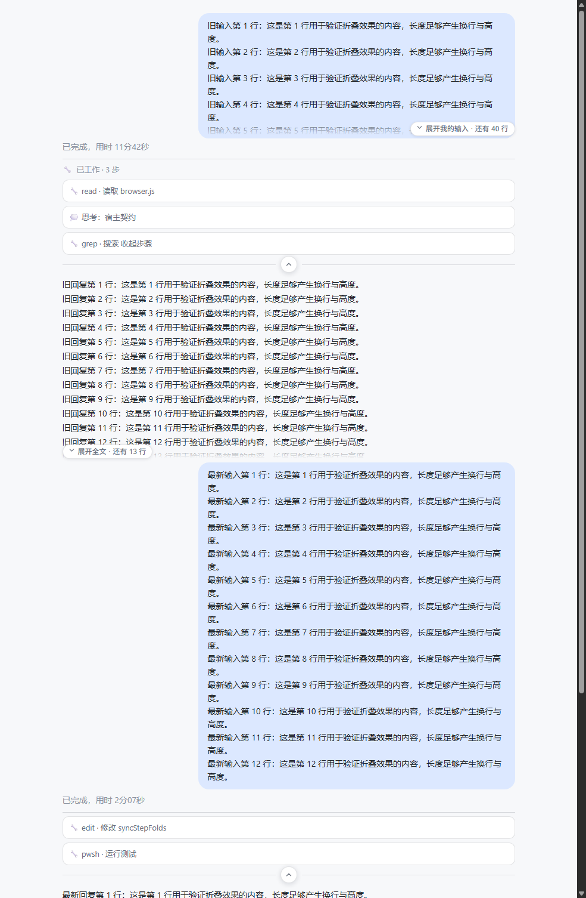

# dsh-bubble-fold

让 DSH 里**过长的消息**（你自己发的长输入、助手的长回复）折叠成几行预览，点一下展开。

> 术语：**用户消息**在宿主代码里就叫 `bubble`（气泡，右对齐圆角块）；**助手回复不是气泡**，它是 markdown 正文块（`.mdBody`）。两者在本文里统称"消息"。

> 这是为「上下文太长、滚轮要滑很久」这个具体场景写的显示层插件。折的是**消息正文**和**夹在消息之间的工作步骤**。

## 它做什么

**默认按"读最新一轮"来摆**：

- **最新一轮的消息永远是展开的** —— 你正在读的那条输入和那条回复，再长也不折
- **之前轮次的消息**超过预算就折成几行 + 淡出（用户输入 6 行 / 助手回复 10 行）
- **每一段工作步骤默认收起**（最新的那一轮也收起），只在步骤与下面那条回复之间留一个折叠缝
- **正在流式输出的回复不折** —— 打字过程中被限高会很难受，等这一轮结束再折
- **短消息原样不动**：只有真的超出预算才折，不会给每条消息都塞一个按钮
- 新的一轮开始时，上一轮自动从"最新"退成"历史"，它的长消息随即折起来

## 安装

### 从 GitHub

```sh
dsh plugin --profile web add 'github:FiVE0016/dsh-bubble-fold#v0.9.0'
```

（把 `web` 换成你的 profile 名：桌面版是 `desktop`；也可以在 **设置 → 插件** 里装。）

### 从本地目录

```sh
dsh plugin --profile web add /absolute/path/to/dsh-bubble-fold
```

### 从 tarball

```sh
npm pack                                    # 产出 dsh-bubble-fold-0.9.0.tgz
dsh plugin --profile web add /absolute/path/to/dsh-bubble-fold-0.9.0.tgz
```

装完**重启**宿主（`dsh web` 或桌面版）：host 半与客户端 bundle 都只在启动时加载。

## 截图

默认状态 —— 历史消息折成几行、每段步骤收起成一条折叠缝，最新一轮保持展开：



点开折叠缝之后，一整套步骤原样回来：



## 明确不碰的东西

| 不碰 | 说明 |
|---|---|
| 会话日志 | 只改 DOM 显示，`session/*` 事件一条都不写 |
| 模型 / agent | 零提示词注入，模型看到的内容一个字节都不变 |
| 上下文注入、系统提示词卡、附件行 | 全部跳过，不参与折叠 |
| 正在跑的那一轮的过程行 | 不去抢先动它，等回复落地再折 |

## 用法

**默认开箱即用**：装好重启 DSH 后，最新一轮保持展开，历史消息与全部步骤收起。

### 控制按钮在哪里

**没有浮动条、没有批量按钮**（0.4.0 移除了 `fixed` 在输入框上方的浮动条，0.5.0 移除了批量键 —— 它们既没用，悬停时还会和每次扫描的 DOM 写入打架而闪烁）。现在是**每条折叠消息一个气泡胶囊键、每一段工作步骤一个折叠缝**：

| 位置 | 按钮 | 作用范围 |
|---|---|---|
| 每条**折叠的**消息下方 | 气泡胶囊 `▾ 展开我的输入 · 还有 12 行` / `▾ 展开全文 · 还有 30 行`（展开后变 `▴ 收起`） | **只这一条**消息 |
| **工作步骤与后面那条回复之间** | 一条横线上的圆形气泡键（只有 ▾/▴ 图标，悬停有提示、写明多少步） | **这一段里的全部工作步骤** |

「一段工作步骤」指的是**夹在两条消息之间的一整串过程行**（工具调用、思考…）。折叠缝固定在**最后一个步骤行与下面那条回复之间**：它上面全是步骤，下面就是回复正文。这一串如果横跨了好几轮对话（连续自动续跑、中间没有回复），**一个键就把它们全部折起来**，不是每轮一个。下面还没有回复时（这一轮还在跑）不出现，等回复落地才补上，并**默认就是收起的**。

折叠由谁来折，取决于宿主当前的工作详情模式 —— 两种都由同一个折叠缝驱动：

| 宿主渲染方式 | 折叠缝做什么 |
|---|---|
| **分组模式**（工作详情 compact / standard，以及 detailed 的已结束轮） | 步骤被包在 `[data-step-process]` 容器里，容器自带一个标题开关。折叠缝**点击宿主自己的开关**（以及各轮的 `[data-turn-process]` 摘要行），状态完全归宿主，连它自己的标题箭头都同步 |
| **内联模式**（工作详情 verbose，宿主不提供开关） | 宿主的摘要行是 `disabled`、步骤全部展开。此时折叠缝**自己把这串行折起来**：在这些行上打一个私有属性（`data-lf-step-folded`）配合 CSS 隐藏，纯显示层，插件的开关一关或卸载，行立刻全部回来 |

折叠缝上的箭头和提示会跟随当前状态在「展开步骤 / 收起步骤」之间切换。**你自己点开过的那一段不会再被自动收起** —— 自动折叠只发生在一段块第一次出现时。

| 快捷键 | 效果 |
|---|---|
| `Ctrl + Shift + B` | 一键停用 / 启用插件 |
| `Ctrl + Shift + ,` | 打开设置弹窗（没有常驻按钮，只能这样进） |
| `Esc` | 关闭设置弹窗 |

### 输入框高度（0.6.0 起，0.7.0 修复"拖了没反应"，0.8.0 修正方向）

宿主把输入区限制在 `--dsh-composer-text-max-height`（默认 336px），超出后内部滚动。**0.6.x 只抬高了这个上限：内容短的时候，拖拽看不出任何变化**（这就是"调节器不起作用"的原因）。0.7.0 起插件在输入框卡片顶部加了一条拖拽手柄，手动模式会同时**钉住输入区的实际高度**：

| 操作 | 效果 |
|---|---|
| **向上**拖手柄 | 输入框变**高**（手柄在顶边，提起顶边=拉高，跟手不跳变） |
| **向下**拖手柄 | 输入框变**矮** |
| 双击手柄 | 恢复宿主默认 336px（并清除记录） |
| `Ctrl + Shift + ↑ / ↓` | 微调输入框高度 ±40px |
| 设置面板里的「输入框高度」 | 直接输入数值，等价于拖拽；留空恢复默认 |

高度存在 `dsh.bubble-fold.composer-height`，重启后保留。手柄是卡片里的普通 flex 元素（`order: -1` 固定在最上），不是浮动覆盖层，不会挡住输入框或发送按钮。**注意**：宿主的引导弹窗（预览版说明 / 添加 API Key）是 `aria-modal` 全屏遮罩，打开时会挡住弹窗下方的一切（包括手柄），这是宿主行为，关掉弹窗即可。

**输出宽度请用宿主自带的左右拖拽手柄**（会话区两侧边缘），插件不再提供宽度功能。

### 设置项

用 `Ctrl + Shift + ,` 打开（弹窗形式，不常驻；点击外部或 Esc 关闭），存在浏览器 localStorage（`dsh.bubble-fold.settings`），改动即时生效：

| 项 | 默认 | 说明 |
|---|---|---|
| 启用插件 | 开 | 总开关，关掉立刻恢复原生显示 |
| 最新一轮保持展开 | 开 | 最新那一轮的消息再长也不折（你正在读的就是它） |
| 折叠我的输入 | 开 | 只管用户气泡 |
| 我的输入保留行数 | 6 | 折叠后露出几行 |
| 折叠助手回复 | 开 | 只管助手回复 |
| 助手回复保留行数 | 10 | 同上 |
| 全部消息都折叠 | 关 | 打开后连短消息也按「折叠后保留行数」处理（最新一轮仍受上面那项保护） |
| 折叠后保留行数 | 3 | 上面那档用的行数预算 |
| 淡出与按钮留白 (px) | 34 | 淡出渐变与按钮占的高度，太小会盖住最后一行 |
| 步骤区与回复之间加折叠按钮 | 开 | 在每串工作步骤和下面那条回复之间放一个折叠缝 |
| 步骤默认收起 | 开 | 每段步骤第一次出现时自动收起（最新的那一轮也收起） |
| 输入框可拖动调高 | 开 | 显示拖拽手柄 |
| 输入框高度 | 336 | 直接设置高度上限（留空恢复默认） |

浏览器控制台也能改（便于排查）：

```js
__DSH_BUBBLE_FOLD__.settings()               // 看当前设置
__DSH_BUBBLE_FOLD__.update({ userLines: 3 }) // 改一项
__DSH_BUBBLE_FOLD__.rescan()                 // 强制重扫
__DSH_BUBBLE_FOLD__.stats()                  // 性能计数器（见下）
__DSH_BUBBLE_FOLD__.dispose()                // 临时停用并还原 DOM
__DSH_BUBBLE_FOLD__.status                   // 'running' | 'failed'
```

### 性能：为什么它必须"懒惰"

长会话可以有 **1000+ 个 flow item**。这条链路里每一步都很贵：读 `scrollHeight` 会触发**强制同步重排**，而写属性会触发插件自己的 MutationObserver。

`__DSH_BUBBLE_FOLD__.stats()` 会告诉你实情：

| 字段 | 含义 | 健康表现 |
|---|---|---|
| `scans` | 扫描次数 | **空闲时应停止增长** —— 持续增长就是自我喂养的循环 |
| `measured` | 本轮真正做过布局测量的行数 | 应远小于总会话行数 |
| `selfMutations` | 由插件自己节点触发的变更 | 一次折叠后应停止增长 |

为此有三道闸门，删任何一个都会让界面变卡：

1. **写入幂等** —— 值没变就不碰 DOM，否则自己的写入会触发自己再扫一次，形成 60fps 永不停止的循环
2. **视口闸门** —— 只测量屏幕附近（上下各一屏）的消息；滚入视口时再折
3. **每帧 4ms 预算**（`SCAN_BUDGET_MS`）—— 超时就 `requestAnimationFrame` 续做，绝不在一帧里处理上千行

实测（真实 Chrome，1200 条消息的会话）：空闲 4 秒 **0 次扫描**；强制扫描一次 **2.1ms**，只测 28 行。

## 实现方式与它的代价

**纯客户端插件**（`index.js` 是无副作用的空壳，只为让 bundle 被加载）。折叠靠两条东西：

1. **宿主 DOM 契约属性**：`data-chat-flow-kind="user" | "assistant-step"`、`data-chat-anchor-key`、`data-streaming`、`data-turn-process-*` 等，加结构下钻找气泡本体。**不依赖 CSS Module 的哈希类名**，所以宿主换皮不会失效。
2. **只动样式与自有节点**：限高走 `max-height` 变量 + 私有属性选择器；展开按钮挂在 React 托管范围之外，React 重渲染时不参与 diff。

⚠️ **诚实说明代价**：这仍然是一条 DOM 契约路线。DSH 升级若改了上面那些 `data-*` 属性的含义，折叠会失效 —— 但它**失效的方式是"不折了"，而不是弄坏会话**：设置里关掉插件、或直接卸载，DOM 立刻回到原生状态。这也是没有走 "fork 宿主气泡渲染器" 那条路的原因（那样效果更彻底，但每次宿主升级都要重新适配）。

## 兼容性

- 宿主：`@deepseek-ai/dsh` 0.2.0-rc.2（契约按这个版本核对，见 `src/browser.js` 顶部注释）
- 与 DSH 原生「工作步骤展示」、过程折叠、右缘 TurnNavigator **互不干扰**（不同 DOM 区域）
- 与 `dsh-thought-fold` 同时装没有冲突（它折过程包封，本插件显式跳过包封内部）

### ⚠️ `dsh.client.immediately` 不能删

`package.json` 里这一行是**必需**的：

```json
"dsh": { "client": { "platform": "web", "immediately": true, "inject": [] } }
```

客户端 bundle 走宿主的启动图（`window.__DSH_BOOT__`），而**只有被标记 `immediately` 的行、或被其他模块请求的行才会被执行**。本插件是纯 DOM 插件，不向任何 slot 注册组件，因此没有任何东西会“请求”它 —— 去掉 `immediately` 后 bundle 仍会被投递但永不执行，表现就是控制台里 `__DSH_BUBBLE_FOLD__` 为 `undefined`、界面上什么都不发生（0.1.0 正是这样失败的）。

`inject` 留空同样是故意的：列 UI 模块只为排序激活，而本插件不依赖任何客户端服务。

## 结构

```
index.js              宿主侧空壳（注入服务为空，无副作用）
client.js             构建产物：浏览器半，由宿主模块加载器投递
cordis.patch.yml      bundle 补丁：把 bubble-fold 行插进平台树
src/fold.js           纯逻辑（设置归一化、限高计算、折叠判定）—— 可在 plain Node 下测
src/browser.js        DOM 运行时（扫描、包裹、按钮、设置面板、快捷键）
src/client-entry.js   ModuleLoader 入口，构建时被拼进 client.js
scripts/build.mjs     把上面三个文件打包成单文件 client.js
test/fold.test.mjs    纯逻辑单测（20 项）
test/runtime.test.mjs 运行时、交互与**真实 client.js 构建产物**的加载测试（68 项）
test/visual-fixture.html  宿主样式的可视化夹具（两轮对话 / 步骤串 / 两种步骤布局）
test/visual-check.mjs     真实 Chrome 里跑夹具：默认折叠状态、几何、点击行为 + 生成 assets/ 截图
test/diagnose.js          排查用：贴进页面控制台，打印宿主模式与插件状态
assets/               README 里的截图（由 test/visual-check.mjs 生成）
```

## 开发

```sh
node scripts/build.mjs            # 重新打包 client.js
node scripts/build.mjs --check    # 检查 client.js 是否与源码同步
node test/fold.test.mjs           # 纯逻辑
node test/runtime.test.mjs        # DOM 与交互（不需要浏览器）
node test/visual-check.mjs        # 真实 Chrome 渲染检查（需要本机 Chrome，同时刷新 assets/ 截图）
```

改完 `src/` 必须重新构建：宿主加载的是 `client.js`，不是 `src/`。**提交前请把 `client.js` 一并提交** —— 宿主直接加载它，它才是真正跑起来的东西。

### 三个已经踩过的坑

1. **`index.js` 必须能被 `import()` 解析。** 它是 ESM 入口，宿主用裸 `import()` 加载。0.1.0–0.1.3 在这里失败过：文件开头写成了 Python 风格的 `#` 注释 —— 第一行被 Node 当成 shebang 跳过，**第三行直接是语法错误**，于是宿主报 `bubble-fold (dsh-bubble-fold): failed to import`，宿主半不存在 → 客户端 bundle 也就永远不会被执行。改完务必跑一次导入自检：

   ```sh
   node -e "import('./index.js').then(m=>console.log('OK',Object.keys(m)))"
   ```

2. **`factory` 不能声明 `require` 参数。** 宿主这样调用 bundle：

   ```js
   registration.factory(specifier => { /* 只认 react 等平台模块，其余全部抛错 */ })
   ```

   `build.mjs` 在 IIFE 作用域上提供了自己的 `require`（先查本地模块表，兜不住才落到宿主）。一旦写成 `factory: (require) => {…}`，**这个参数会遮蔽包内的 `require`**，于是 `require('./src/browser.js')` 跑到宿主模块表里去要，直接炸：

   ```
   dsh-bubble-fold: import failed: client-modules: require("./src/browser.js") missed the module table
   ```

   桌面端会把它显示成「应用无法启动」对话框（这就是 0.1.5 的现象）。正确写法是 `factory: () => {…}`。
   `test/runtime.test.mjs` 现在用**只认 `react` 的严格替身**调用 factory，这类遮蔽会被测试直接抓住。

3. **别用 PowerShell 的 `Set-Content -Encoding UTF8` 改 `package.json` / `client.js`。** Windows PowerShell 5.1 会写入 BOM，Node 的 `JSON.parse` 直接报 `Unexpected token '\uFEFF'`。用 Node 脚本改：

   ```sh
   node -e "const fs=require('fs');fs.writeFileSync('package.json', fs.readFileSync('package.json','utf8'))"
   ```

## 许可

MIT，见 [LICENSE](LICENSE)。
